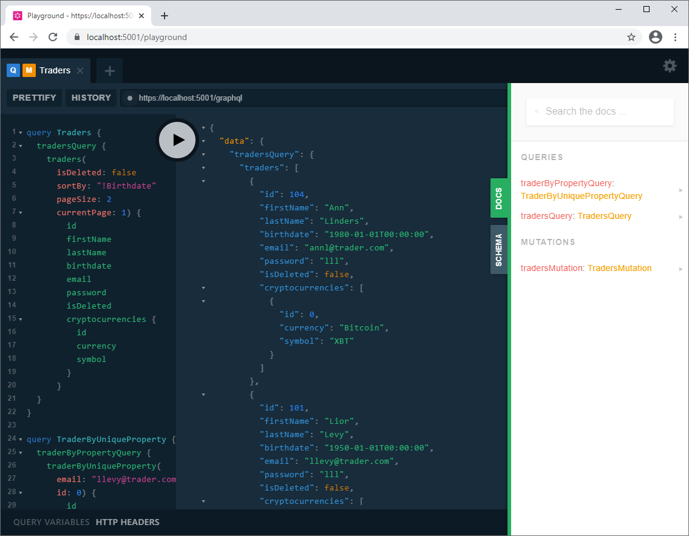
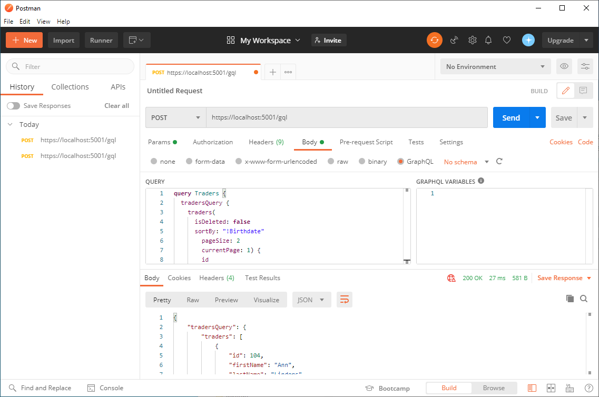
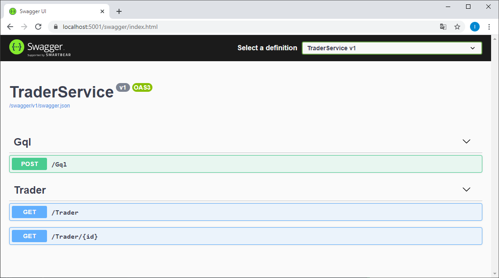
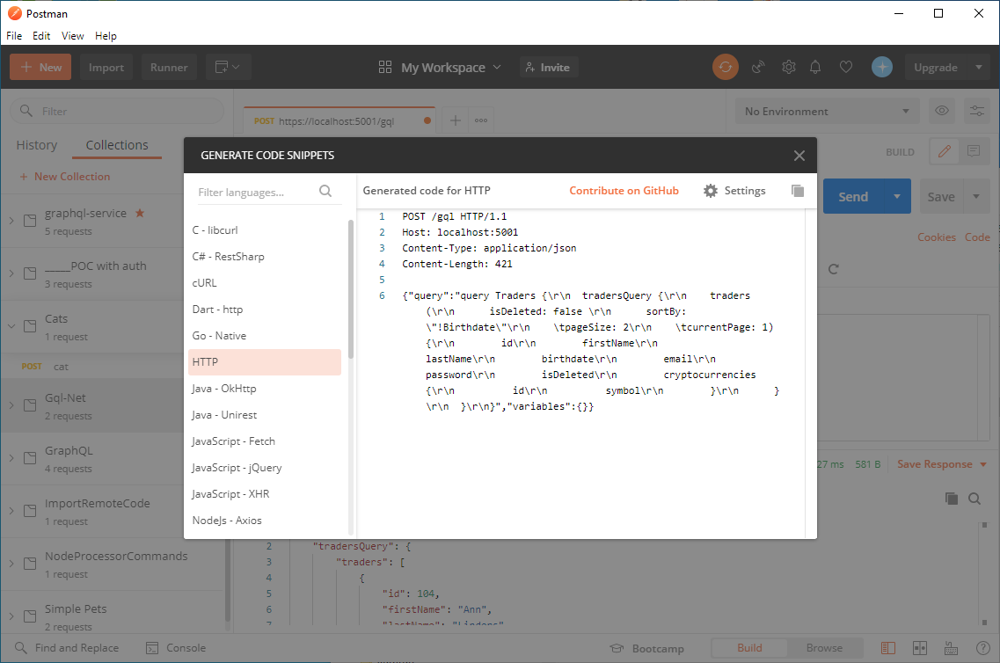

---

---

# A Simple Trader Service


### Intro

The service provides a very simple handling (basic CRUD operations) of traders list. It is based on [GraphQL](https://en.wikipedia.org/wiki/GraphQL) technology. GraphQL allows to retrieve and submit stored data in a very ordered and at the same time flexible manner. It provides schema acting as a contract between client and server. The schema also defines retrieval procedure in the server.


### How to Run?

##### Prerequisites (for Windows):

 - Local SQL Server (please see connection string in file *appsettings.json* of the service),
 - Visual Studio (VS) 2019 with .NET 5 support.


##### Sequence of Actions

1. Open solution *TraderService.sln* with Visual Studio 2019 (VS) that supports .NET 5 and build it.

2. SQL Server is used. For the sake of simplicity, Code First paradigm is adopted. Database *TradersDb* is automatically created when either the service or its integration tests run. Please adjust connection string (if required) in  *.\appsettings.json* service configuration file.

    On the start, database is filled with several initial records from the code. To ensure proper functioning of identity mechanism all those records are assigned with negative *Id*-s except *Cryptocurrency* records since appropriate database table will not change programmatically (please see class *TraderDbContext*).  

3. Run *TraderService*.
    3.1 It may be carried out from VS either as a service or under IIS Express.
    Browser with *Playground* Web UI application for GraphQL starts automatically.
    3.2 Alternatively, the service may be started by activating *.\TraderService\TraderService\bin\Debug {or Release}\net5.0\TraderService.exe* .
    In this case browser should be started manually navigating on https://localhost:5001/playground when the service is already running.
    In *Playground* Web page you may see GraphQL schema and play with different queries and mutations. Some predefined queries and mutation may be copied from *Queries and Mutations with Playground* chapter of this document.

​    

Fig. 1. Playground Web page.


4. *Playground* application uses middleware to get response bypassing *GqlController* (it is mostly used during development, but in this project available in all versions). It does not call *GqlController* that is used by clients in production. To work with *GqlController* you may use Postman application.
   From Postman make a POST to https://localhost:5001/gql with Body -> GraphQL providing in QUERY textbox your actual GraphQL query / mutation.




Fig. 2. Postman.


5. You may also use *OpenApi* (a.k.a. *Swagger*): browse to https://localhost:5001/swagger and activate POST /Gql .




Fig.3. Swagger Web page.


In Postman press *Code* link in the upper-right corner, copy query to Swagger's *Request body* textbox and execute method.




Fig. 4. Code textbox in Postman


6. In all cases you may use unsafe call to http://localhost:5000 (allowed for illustration and debugging).

7. Integration tests may be found in project *TraderServiceTest* in directory *.\Test* .

   

### Queries and Mutations with Playground

*Playground* is a Web application that may be activating by GraphQL libraries middleware out-of-the-box (in this case NuGet package *GraphQL.Server.Ui.Playground* is used). It offers convenient and intuitive way to  define, document and execute GraphQL queries and mutations. *Playground* provides intellisense and error handling. It also shows GrpahQL schema and all queries and mutation available for a given task. Screenshot of *Playground* is depicted in Fig. 1 above.   

These are examples of queries and mutation for our solution. You may see their description in *Playground* DOCS pane.


```
query Traders {
  tradersQuery {
    traders(
      isDeleted: false 
      sortBy: "!Birthdate"
      pageSize: 2
      currentPage: 0) {
        id
        firstName
        lastName
        birthdate
        avatar
        email
        password
        isDeleted
        cryptocurrencies {
          id
          symbol
        }
      }
  }
}
```


The above *Traders* query returns all traders met the conditions defined by four non-mandatory arguments.

*isDeleted* filters active / deleted traders. Default value is *false*. 

*sortBy* sorts the traders by any of their properties (non-case-sensitive), e. g. *birthdate*. If exclamation sign precedes the property name then sorting will be performed in descending order.  No sorting by default.

*pageSize* and *currentPage* are used for pagination. Default value for both is *0*, meaning no pagination. 


```
query TraderByUniqueProperty {
  traderByPropertyQuery {
    traderByUniqueProperty(
      email: "llevy@trader.com"
      id: 0) {
        id
        isDeleted
        firstName
        lastName
        avatar
        cryptocurrencies {
          id
          currency
          symbol
        }
      }
  }
}
```


Query *TraderByUniqueProperty* returns a single trader by its unique parameter - either email (preferred) or *id*.


```
mutation TradersMutation {
  tradersMutation {
    createTraders(
      tradersInput: 
      [
        {
          firstName: "Lior"
          lastName: "Levy"
          birthdate: "1950-01-01"
          avatar: "www.trader/member/images/llevy.png",
          email: "llevy@trader.com"
          password: "lll"    
          isDeleted: false
          cryptocurrencies: [{ id: 1 }{ id: 3 }]
        }
        {
          firstName: "Ann"
          lastName: "Linders"
          birthdate: "1980-01-01"
          email: "annl@trader.com"
          avatar: "www.trader/member/images/annl.png",
          password: "lll"    
          isDeleted: false
          cryptocurrencies: [{ id: 1 }{ id: 3 }]
        }
      ]
    ) 
    {
      status
      message
    }
  }
}
```

Mutation *TradersMutation* allows user to create new traders and/or update existing ones.


### Testing

Integration tests are placed in project *TraderServiceTest* (directory .\Test) in class *GqlControllerTests*.  In-memory service is used for integration tests (please see *IntegrationTest* base class for tests). This approach considerably reduces efforts to develop integration tests. Tests may be run out-of-the-box since they create and initially fill database.


 